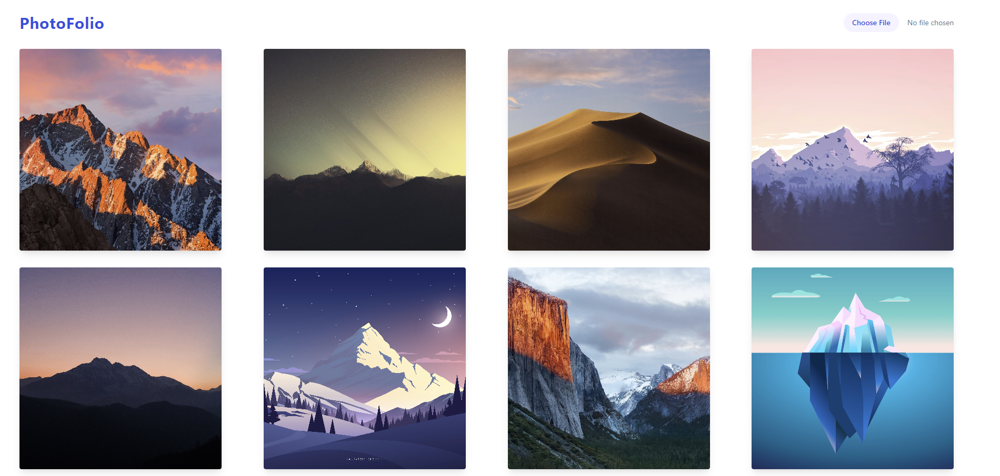

# PhotoFolio Frontend

This is frontend submodule of [photofolio](https://github.com/abhishekpatelmc/photofolio.git). It is a Next.js app which uses tailwindcss for styling.

- Main repo: https://github.com/abhishekpatelmc/photofolio.git

## Demo


## Installation

- clone the main repo
- navigate to frontend directory

```bash
cd src/main/frontend
```

- install dependencies

```bash
npm install
```

- start the app

```bash
npm run dev
```

- open http://localhost:3000 in browser
